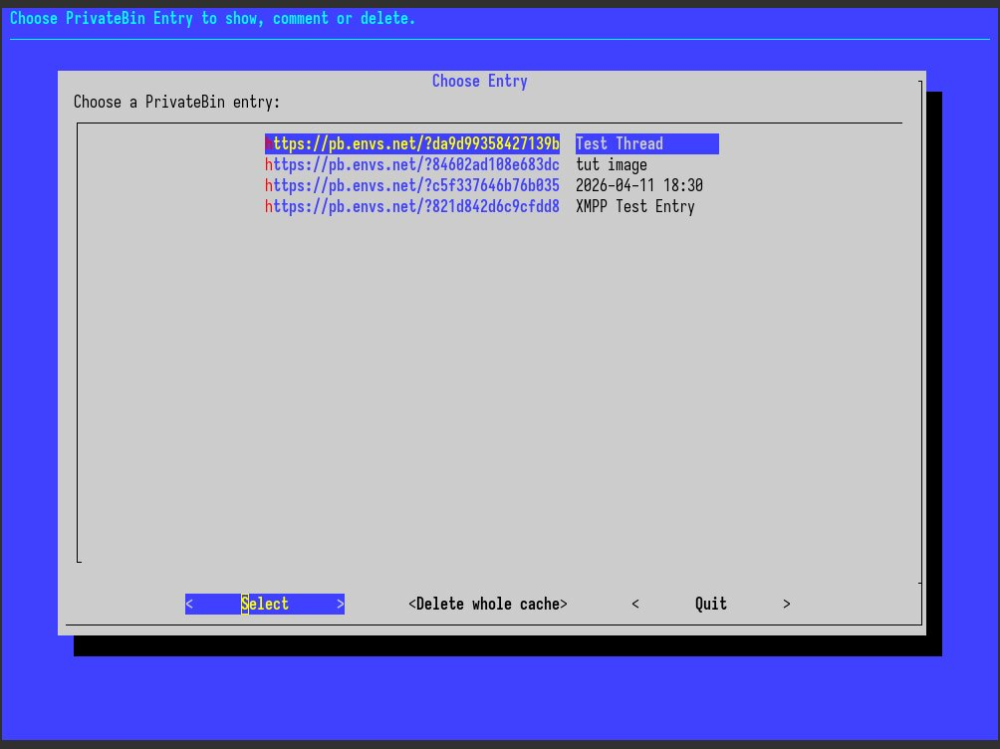
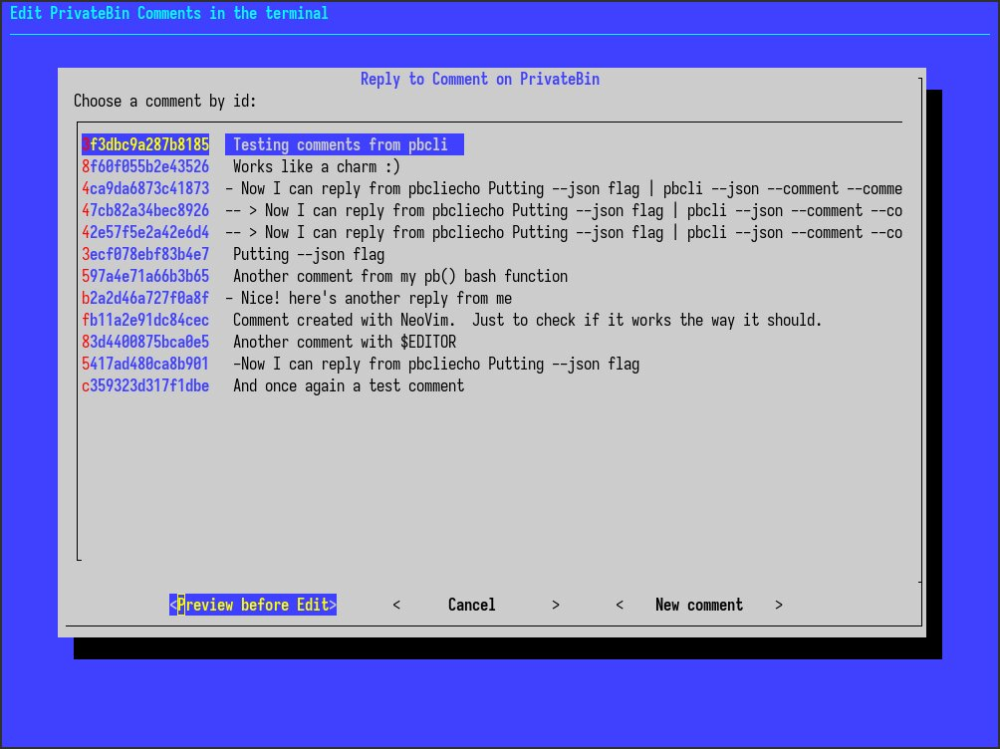

# PBEasy (ppb, for PivatePasteBin) - PrivateBin Terminal Helper Script

PBEasy (`ppb`) is a Bash script that streamlines the process of creating,
uploading, and commenting on [PrivateBin](https://privatebin.info/)
pastes directly from your terminal. It provides an interactive interface
for replying to comments, supports attachments, and integrates with your
preferred text editor.

**PBEasy Paste Selector:**


**PBEasy Comment Chooser:**


---

**NOTE:**

Unfortunately I get the same error message, if the Paste has expired, Comments
are off or it just temporary fails to get the JSON data (which can happen).

So if you're sure, the Paste hasn't expired and Comments are turned on,
simply try again to fetch the Comments of the Paste.

You also have to delete expired Pastes manually if you don't want your cache
be cluttered with old Pastes. There is no easy way to determine if a Paste
has expired, so you have to do it manually. If you're not sure, try to use the
"Open" function, to see if the Paste is still available.

You can also delete the current cache file and start with a clean one (use with
care!).

---

## Features

- **Interactive use** of the `ppb` command, when used without parameters and pipe
- **Create new PrivateBin pastes** from files or stdin. These are automatically
  added to a local cache for easy access.
- **Upload attachments** (images, files) with optional comments. Also
  automatically added to the cache.
- **Interactive comment/reply selection** using `dialog`.
- **Reply to nested comments** with preview and editing.
- **Clipboard integration**: Automatically copies resulting URLs using `xclip`.
- **Uses your `$EDITOR`** for editing comments and replies.
- **Customizable defaults** via a config file.

---

## Dependencies

Make sure the following tools are installed:

- [`pbcli`](https://github.com/Mydayyy/pbcli) (PrivateBin CLI client written in rust)
- [`jq`](https://jqlang.org/) (JSON processor)
- [`dialog`](https://invisible-island.net/dialog/) (terminal UI)
- [`xclip`](https://github.com/astrand/xclip) (clipboard utility)
- `fold`, `mktemp`, `diff`, `cat`, `tee` (coreutils)
- A text editor set in your `$EDITOR` environment variable (e.g., `nvim`, `vim`, `nano`)

---

## Installation

1. **Download the script:**

   Save the `ppb` script to a directory in your `$PATH`, for example:

   ```sh
   mkdir -p ~/bin
   cp ppb ~/bin/
   chmod +x ~/bin/ppb
   ```

   Ensure `~/bin` is in your `$PATH` (add `export PATH="$HOME/bin:$PATH"` to
   your shell config if needed).

2. **Create initial configuration:**

   Run:

   ```sh
   ppb -i
   ```

   This creates a config file at `$XDG_CONFIG_HOME/pbeasy/config.sh` (defaults
   to `~/.config/pbeasy/config.sh`). Edit this file to change default server,
   format, or discussion settings.

---

## Usage

```sh
ppb [-i] | [ -u <FILE> | -c <URL> ] [ -d | -D ] [-f <FORMAT> ] [-s <HOST URL>] [-n <name>] | [-h]
```

### Options

- `-i`  
  Create a default config file at `$XDG_CONFIG_HOME/pbeasy/config.sh` with default settings.

- `-u <FILE>`  
  Upload a paste from command line as an Attachment. Images will be shown. Plaintext, Markdown and Source Code must be piped in, otherwise they'll be shown only as an attachment! If no URL is provided, sends to your configured PrivateBin instance.

- `-c <URL>`  
  Comment or reply to a comment on a PrivateBin paste. If a URL is provided, fetches comments and allows replying by choosing a comment/reply from a list (with preview). The content you reply to is copied into your edit file in your `$EDITOR`. If no comment is selected, creates a new comment. Uses the `--comment-as=name` from your `pbcli` config file by default as your pseudonym. If not set, it's anonymous.

- `-d`  
  Enable discussion/comments for the paste, discussion is on by default.

- `-D`  
  Disable discussion/comments for the paste, discussion is on by default.

- `-s <HOST URL>`  
  Specify the PrivateBin server. Defaults to `https://privatebin.net/`.

- `-f <FORMAT>`  
  Specify the paste format: `markdown`, `plaintext`, or `syntax`. Default is `plaintext`.

- `-n <name>`  
  Specify Name for the Paste, otherwise the actual date will be used as name in the cache.

- `-h`
  Show help message.

---

## Examples

- Run without arguments or piping to enter interactive mode and browse stored URLs:

  ```sh
  ppb
  ```

  This lets you open, comment/reply, or delete pastes in the cache. Note: There is no easy way to determine if a paste has expired, so you must delete them manually if they no longer work. You can also delete the whole cache file and start with a clean one (use with care!).

- Send a file as a new PrivateBin paste in markdown format:

  ```sh
  ppb -f markdown < file.md
  ```

  The link will automatically be added to your cache (and needs to be deleted later).

- Comment or reply to a comment on a given paste:

  ```sh
  ppb -c "https://your.privatebin/paste#key"
  ```

  The link to the paste will be automatically added to your cache.

- Send a new paste with comments enabled in plaintext format using piping:

  ```sh
  cat political_statement.txt | ppb -d -f plaintext
  ```

  The paste will be added to your cache.

- Send an image with a comment and a custom name:

  ```sh
  echo "My nice picture" | ppb -u image.png -n 'Nice Image'
  ```

  This sends image.png with the comment "My nice picture" as a new paste. The paste will be added to your cache with the name "Nice Image" (names are just short identifiers to help you find them).
  ```

---

## Configuration

Edit `$XDG_CONFIG_HOME/pbeasy/config.sh` to set:

- `HOST` (default PrivateBin server)
- `FORMAT` (default paste format)
- `DISCUSSION` (enable/disable comments by default)

Other options (like `--comment-as=<name>`) are read from your `pbcli` config file.

---

## Use Issue Tracker

If you have any problems with `ppb`, use the Issue tracker:

- https://github.com/redterminal-org/pbeasy/issues

---

## License

This script is licensed under the **GPL-3.0-only** license. See [LICENSE](LICENSE) for details.
